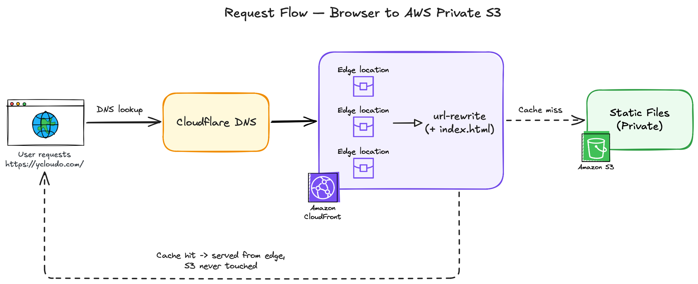
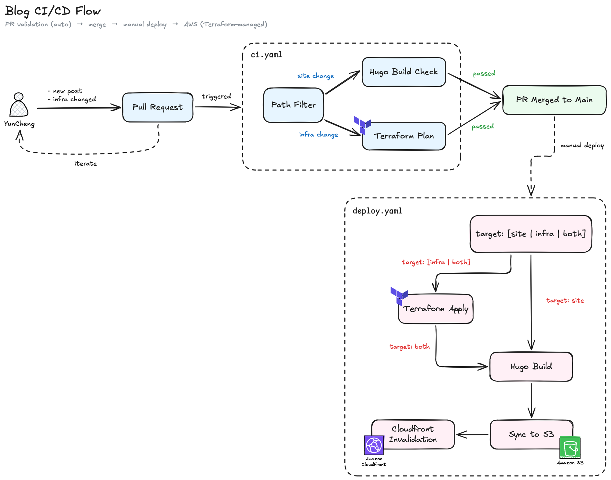

# Yun Cheng's Blog

A personal blog at **[ycloudo.com](https://ycloudo.com)** — a Hugo static site (PaperMod theme) hosted on AWS behind CloudFront, with a fully private S3 origin. All infrastructure is defined in Terraform and shipped through GitHub Actions using short-lived OIDC credentials.

---

## Basics

The site is generated with [Hugo](https://gohugo.io/) and the [PaperMod](https://github.com/adityatelange/hugo-PaperMod) theme (added as a git submodule). Build output is synced to a private S3 bucket and served globally through CloudFront over HTTPS; the bucket itself is never publicly reachable. DNS and the domain live on Cloudflare, TLS is handled by AWS ACM, and everything except content authoring is automated.

Hugo source and Terraform live together in a single monorepo, and GitHub Actions scopes its jobs by directory.

## Request Flow — Browser to AWS Private S3

1. **DNS lookup.** A visitor opens `https://ycloudo.com/`. Cloudflare resolves the apex domain (via CNAME flattening) to the CloudFront distribution.
2. **Edge.** The request lands at the nearest CloudFront edge location.
3. **Cache hit.** If the edge already has the object, it is served straight from the edge and **S3 is never touched** — the fast path for the vast majority of requests.
4. **Cache miss → URL rewrite.** On a miss, CloudFront runs the `url-rewrite` CloudFront Function (`terraform/cloudfront.tf`) on the viewer request. It maps directory-style URLs to their underlying objects: `/` → `/index.html`, and `/posts/foo` → `/posts/foo/index.html`. This is what lets clean URLs resolve against a static file layout.
5. **Private origin fetch.** CloudFront then fetches the object from the private S3 content bucket. The bucket blocks all public access (`terraform/s3.tf`); CloudFront reaches it through **Origin Access Control (OAC)**, and the bucket policy only trusts requests signed by this specific distribution's ARN.

## CI/CD Flow

The pipeline splits into two workflows: automatic validation on every PR, and a manual, targeted deploy after merge.

### Credentials

Every AWS interaction uses short-lived **GitHub OIDC** tokens — there are no long-lived access keys in the repository. Three scoped roles are defined in `terraform/iam.tf`:

| Role                           | Scope                             | Used by                  |
| ------------------------------ | --------------------------------- | ------------------------ |
| `github-actions-blog-tf-plan`  | Read-only                         | PR Terraform plan        |
| `github-actions-blog-tf-apply` | Read-write infra                  | Manual `terraform apply` |
| `github-actions-blog-deploy`   | S3 sync + CloudFront invalidation | Manual site deploy       |
