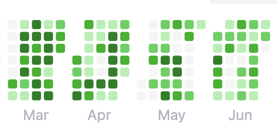

## 前言

我是2025/07 就碩畢，當初沒有找任何的研替或預聘，當初想說當個兵出來找應該也是不會太難找，沒想到情勢險峻，一找也是找了四個月才終於上岸。由於過去的專案經驗，加上實習的內容比較偏 Platform Engineering，所以這次求職我的方向主要放在 Backend、DevOps。我總共是面了10家公司，趁著onboard 前的空檔紀錄一下2026軟體新鮮人求職的經驗。

## 背景

- 學歷：政大資管所
- 實習：Quid 美商網基
- 刷題：150 題左右
- 求職時間：2026/03 ~ 2026/07，大多集中在5-6月

## 求職總覽

- 投遞：沒有特別算，但基本上有聽過名字的公司我都投了
- 面試公司：TSMC、玉山TMA、ASUS、Latticework、17 Live、Splashtop、Otto one.o、Going Cloud、Trend Micro、永豐 Turing
  （這邊列了有去面試的公司，有些我自己覺得方向差太多或沒什麼把握就拒絕了。）
- Offer：玉山TMA、Splashtop、Trend Micro

## 求職準備

我原本是有一個縝密的半年求職計畫：

- 前三個月瘋狂刷力扣
- 後面開始丟履歷 + 面試

以前偶爾刷刷題是蠻快樂的，但後面發現每天都在刷題刷到壓力超大，所以直接後來直接放棄用刷題找工作的心態。

所以我後面就變成一邊準備面試、一邊複習履歷的內容跟新的知識。我大概會分成這幾個面向準備：

- 履歷：專案背景、挑戰、技術選擇的權衡
- 技術知識：Python、DB、Docker、K8s、CI/CD、AWS、Monitoring

但我覺得最重要的還是**如何敘述自己的過去經驗**，一開始會很習慣的想要把每個專案講的Scope很大、挑戰很多…，但後來發現其實一開始可以著重在專案背景跟想解決的問題，不然面試關高機率在一開始的自我介紹會沒辦法抓到這個經驗中的挑戰到底在哪。

## 面試分享

### TSMC TSID SRE

登錄台積線上人才庫後收到面邀，視訊一面，兩位主管對我，一位是SRE Team的工程師，另一位年紀稍大，應該是蠻大的主管。

- 流程：
  1. 大主管請我先自我介紹10-15分鐘，形式不拘。但我只有準備5分鐘左右的ppt，內容涵蓋自介、實習經歷、專案經歷，以及一點點的碩論，因為碩論跟這個職位完全沒相關，所以就簡單帶過。
  2. 大主管和工程師輪流針對自介問問題，大部分集中在k8s、docker container、Argo workflow 以及一些監控的底層技術上。因為我都只有用過，並沒有從頭建構的經驗，所以回答的不是太好。這段過程比較像是技術快問快答而不是討論，不會就換下一題，基本上大主管和工程師都不會針對答案說明對錯等等。
  3. 最後還有一些人格特質的問題，但我覺得主要還是集中在SRE會用到的技術上作探討。
  4. 大約1hr內結束。

大約兩週後收到感謝信。感覺是想要找真的有碰過infra的experienced candidate，只能說菜就多練。可惜的是不知道是不是面得太爛，從此沒再收過台積的任何面邀。

### 玉山 TMA

- 流程：

  TMA 的面試主要是兩關（履歷關＋一面＋最終面）

  1. 一面-總共3.5hr，1hr上機技術考（選擇題+hackerrank）+1hr 人格特質團面+1hr技術團面。上機考是用玉山自己的電腦，所以不用帶自己的電腦，hackerrank也有auto complete 可以用，所以也不需要擔心語法忘記。人格特質應該就照正常發揮就沒問題，主要可能是技術面試的表現。但技術面試的問題五花八門，雖然過去有很多考古題可以參考，但事實是這場一題考古題都沒問出來，大多還是依照大家的回答，面試官根據大家的回答再繼續延伸。面試官不會只讓特定的人一直搶答，會適時詢問比較少發言者的想法，因此不用太擔心回答不到問題，言之有物才是最重要的。
  2. 終面- 約10位面試者與約10位主管+10位MA/TMA學長姊+3位經營團隊（董事長）在階梯教室進行團體面談。有些科技趨勢問題會請TMA回答，大多數問題還是for MA回答，因此不用太擔心被點到自己不擅長的題目。有英文問答的環節，但基本上只要敢講就沒問題。這場比較像是透過玉山的經營團隊更直接的傳達玉山的價值給面試者，結束後還拿了母親節禮物。

對TMA來說，一面過了基本上就過了。整體的面試體驗玉山應該是最頂的，每個人都超客氣而且尊重面試者。我原本投BigData/AI，想去智金處做 Platform Engineering，最後被分到 Fintech，深思熟慮後決定放棄報到。

### ASUS 網站程式設計師

這家是主動邀請的，那一週剛好沒有面試，想說要維持面試的感覺就去面了，但方向跟我原本想要的應該是完全不一樣。

- 流程：

  主要分成兩個部分：線上筆試和主管面談

  - 線上筆試（1hr）：一樣是透過線上的方式進行，用他們系統的考題，hr會請你分享螢幕後開始作答。作答系統使用起來跟Google 表單很像，有題目和回答框。題目大概15題，包括SQL語法，.NET概念、MVC概念、以及倒水桶那類的邏輯問題。後面還會有第二份年代感滿滿的圖形邏輯測驗。
  - 主管面談：這邊表定應該是1hr，但我過去的經驗跟網頁設計和.NET比較沒關聯，我用ppt自我介紹完後，問了一些.NET 使用經驗等等，看我沒用過，給我問問題就結束了。

整體感覺還在用老舊的技術，這個團隊主要就是負責官網架設，成長性來說應該不高。

### Latticework Cloud SW Engineer

104投遞履歷後邀請面試，公司在台元科技園區內，這個職位主要是寫Golang跟C++的 Backend，因為公司要發展新產品線所以有 head count。

- 流程

  主要分成筆試、團隊面談

  - 筆試 C++ 考卷：考了指標、遞迴、記憶體分配等約30分鐘
  - 團隊面談：其他面試心得有寫到主管可能會針對考卷作檢討，但我C++真的不熟，應該答的很爛，所以大部分是針對自介簡報做深入提問，大約 1.5 hr。

主管人很好，整體算是相談甚歡。後續詢問 hr 結果，得到的答案是 C++ 能力不足，因此只有備取。

### 17 Live SRE

在 bambooHR上投遞，兩天後收到hr致電詢問目前找工作情況，由於同時有丟backend，順便確認求職方向，後來告知backend已經招滿，後面就只面SRE。

流程：

17Live的面試通常都是一天就搞定，當天下午線上面了三關：工程師、技術主管、hr，大約耗時2.5-3hr左右。

- 工程師關：由SRE team的工程師面試，主要問題圍繞k8s的特性，像是CPU & Memory 用量太高對Pod來說會有什麼差別，過去有沒有實際解決 production issue 的經驗等等，我過去的經驗比較多圍繞在使用而不是建置 k8s 平台，因此感覺沒有聊得很有共鳴。
- 主管：由SRE team 的leader來面，主要是詢問演算法白板題和一些團隊合作的BQ。
- hr：更多的BQ，介紹公司福利之後就結束。

其實整體面起來體驗還不錯，除了hr面試的時候中途接了個電話，感覺節奏有點跑掉外，主管和工程師人都不錯，一週好像有2天wfh，感覺也是一間福利不錯的公司，最後無聲卡。

### Splashtop SRE

Splashtop 是一間做遠端支援軟體的美商，已經成立20年了。面試流程分為兩階段，技術團隊一面、技術主管和GM 二面。

流程：

- 一面 1.5 hr：跟整個SRE team面試，有四位工程師加主管一同面試。主要是針對k8s的特性和實際解決 production issue 的經驗來問。但因為這個職位是招Jr. SRE，因此我覺得面試官們會更想聽到遇到問題的想法，以及知不知道背後的原理。
- 二面 2 hr：這就是最終面，跟RD team的其他leader和GM面試，大多都圍繞準備的自我介紹問問題，問的問題非常深入，但跟一面一樣，我覺得他們都沒有期望給出最佳的解答，反而是想要聽你遇到這些問題的想法與思路。比較特別的是最後會有一段英文問答環節，以及跟GM談薪水。

最終offer get，薪水有到我跟GM喊的數字。整體公司環境非常好，每人標配電動升降桌和人體工學椅，也有隨處可見的討論白板。但最終考慮到一面時得知有位氣場感覺不太合的工程師會是進去後的mentor，互動上可能會有些隱憂，最後覺得工作氣氛對我來說蠻重要的，深思熟慮後放棄offer。

### Otto one.o Cloud Engineer (AWS / Python)

這是德商Otto Group 在台灣投資的子公司，主要聽起來是負責集團內部各子公司的系統導入與建置服務，在台灣也有少數的toB服務。

流程：

- 一面表定1.5小時，前30分鐘由hr問一些BQ，還有大約3-4題的英文問答，感覺公司很在乎候選人的英文程度。
- 後面就由一位資深工程師面試，但他蠻明顯對我的履歷沒什麼興趣，問一問就說沒問題了，最後考了一題客服系統的設計考題。

三天後感謝信。

### Going cloud Full-stack Engineer

這家是KKCompany的子公司，主要的業務是協助企業導入AI，最大宗的客戶是金融業。會有職缺是因為今年簽到的業務量比預期的多，因此要補一些人。這個職位好像是想招Sr./ Tech Lead，不知道為什麼我會收到面邀，但想說我剛好在台北，就去試試看。

流程：

- 由一位看起來年輕的Tech Lead面試，主要著重在自介專案上的問答，時間大約1 hr。

這家我自介後直接被電爛，很多專案的細節都沒回答好，又太急著堆名詞，導致一直被深入的問下去，沒有把節奏掌握在自己這裡。但也算是蠻有收穫的，因為在這場面試前兩場我都是面SRE，問的方向與SWE不太一樣，趁著這個機會讓自己抓一點SWE的面試感覺。

### Trend Micro 新鮮人計畫

我從4月在workday系統上投遞後，5月中收到codility測驗，一面是安排在6月中。我的流程是：一面 → 二面hr。

流程：

- 一面 1.5 hr：主要就是針對自介簡報瘋狂提問，幾乎所有列在上面的都被問了一次，包括技術的選擇、遇到的困難、除了這個方法還有什麼其他的解法等等。最後問了一題DP的白板題，我沒有給出最佳解。
- 二面人資 1 hr：更多的BQ，沒想到人資關也可以面到一小時，面完只覺得好累。

最終 offer get

### 永豐圖靈

這應該是所有投遞的裡面等待最久的，四月底就有說明會，最終在六月底才接到面試通知。當時一些公司的面到最終階段，想說還是去面面看。有問人資整體的流程，是一面 → 最終二面。

流程：

- 一面：與另一位面試者一同面試2小時，主要有圖靈團隊的學長姊，以及永豐的科技長。概述過專案及自介後，對專案有一些提問，但可能是因為團體面試的關係，對內容沒有停留到太久。比較特別的是後面有各10分鐘的白板題以及系統設計，兩位面試者同時在自己電腦上作答，最後各自分享解法並與面試官們討論。最終讓我們問了一些問題後結束面試。

最終有收到一面通過的通知，但先接受趨勢的offer，婉拒二面邀請。

## 結語

我覺得我的體悟可以分為**對市場的觀察**，以及**探索自己的過程**。

- 我認為自己的程度應該是普通的資訊科系畢業生，並沒有過人的演算法實力或是開源貢獻的經歷。這個條件下，過去的學歷又或是實習經歷，感覺還是能夠幫我在台灣拿到面試的入場券，但這些面試有蠻多間都有考到系統設計的題目，整體因為AI Agent的發展，應該有越來越往 high-level題目的趨勢。
- 經過這幾個月的面試，其實我還是不太確定自己未來想要走的職能方向是什麼，只能透過實際工作來繼續探索。但比較深的體會是，過去的我非常習慣**短期衝刺**來達成目標，無論是高中考大學、考研究所都是。可能成果都還不錯，所以沒有覺得怎麼樣，但找工作的知識其實是沒辦法靠短期衝刺的，對我來說我沒辦法用三個月刷題刷到rating 2000分、我也沒辦法在面試前一週肯完系統設計的題目，而且這樣準備壓力非常大。期許未來自己能以穩定的輸出取代短期的爆發，讓自己隨時處在一個70%準備好的狀態，面對接下來的人生挑戰，保持自己能接受變動的彈性。
