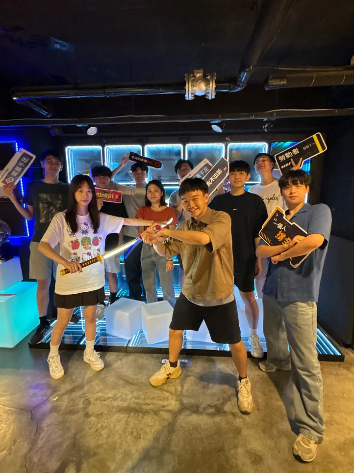
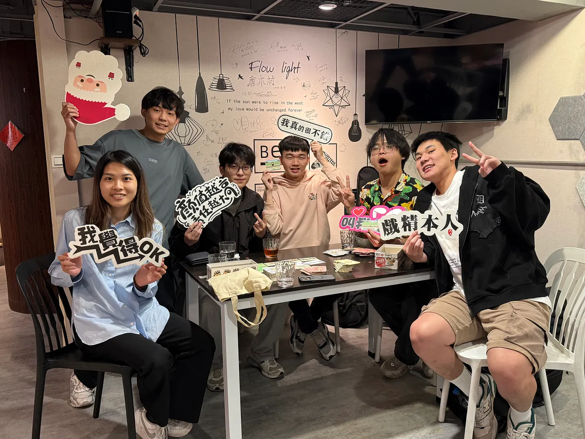
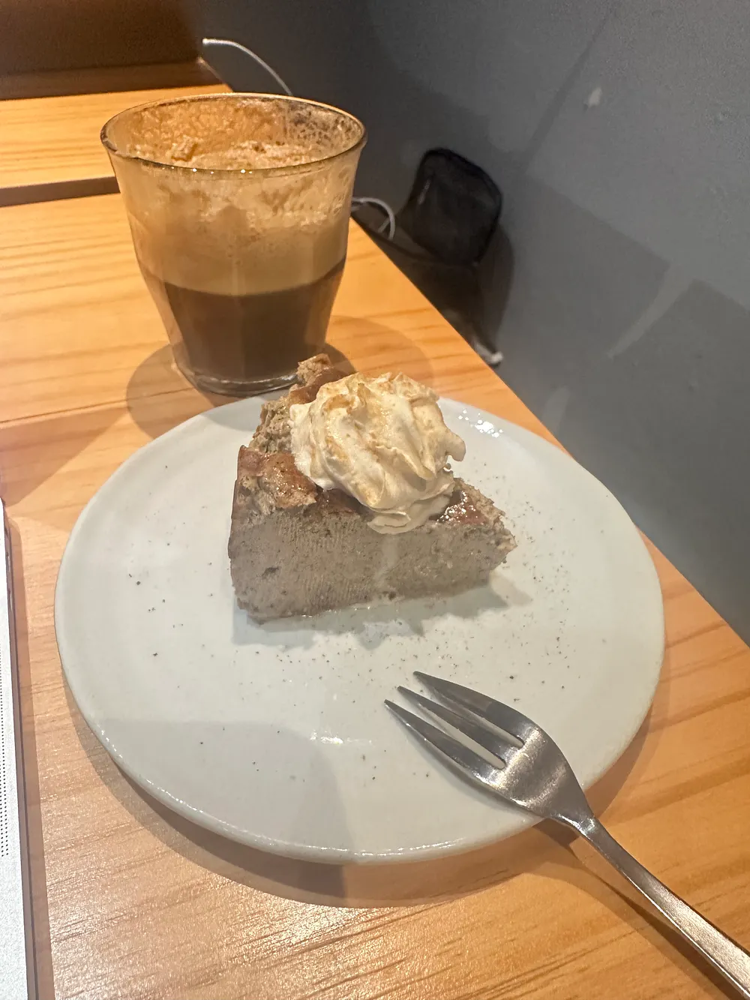
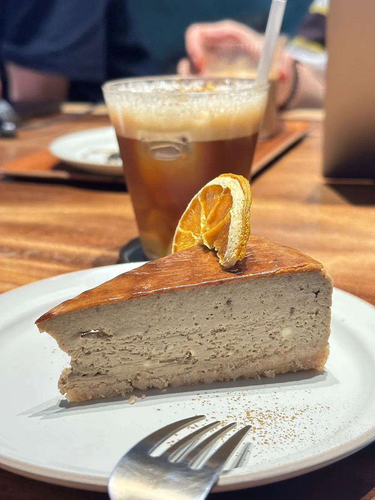
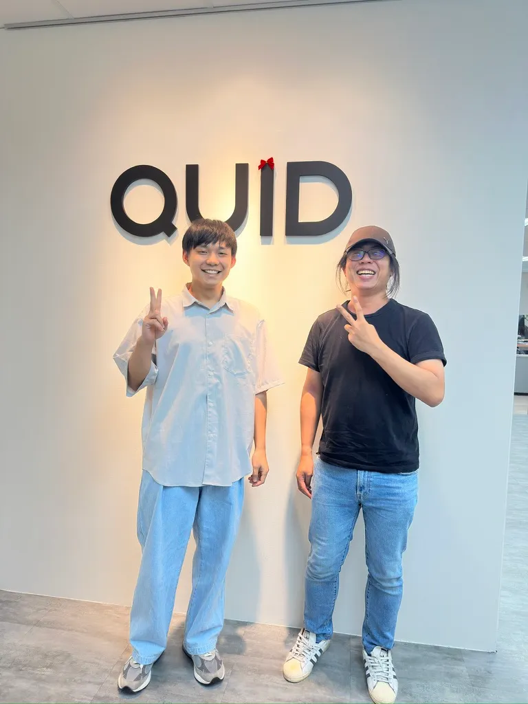

### QUID之前

時間來到2024新年後，所有人都開始投遞履歷，準備尋找2024 Summer Internship，而我也不例外。QUID是我很早就鎖定的職缺之一，而我選擇的是Content Acquisition team所開的職位。投出履歷後，很快的就收到 offsite test 的測驗邀請，offsite test 並不是常見的演算法題目，而是請我們在時間內根據題目要求實作的類型。實作完後，又過了一段時間，我被通知進入下一階段實體面試，公司在西湖七星大樓。

面試當天，我帶著筆電，忐忑不安的來到公司。當時的我還不知道，一場長達五小時的面試馬拉松正等著我。在這五個小時裡，從Director、Engineer、Team Lead到HR輪番上陣，但整個過程中讓我感受最深刻的，並非壓力或緊張，而是一種備受尊重的感覺。

無論是與Director進行Behavior Question時，他所展現的仔細聆聽；與Engineer (當時不知道是我未來的mentor XD)一起討論offsite test實作細節；還是Team Lead引導我在白板上解題時的耐心；甚至是HR中途貼心遞上的茶水 — 都讓我感覺公司很用心對待來面試的人，即使我應徵的只是實習生。另一個讓我印象深刻的觀察是，儘管當時AI Agent的應用才剛普及（LLM的發展速度真驚人），公司在面試時，已經非常鼓勵我與AI輔助討論後再給出答案。這也讓我感受到，QUID是一間很早就開始擁抱AI的公司。

最終，這場面試馬拉松在HR遞上7–11禮券作為車馬費後，劃下了句點。兩天後，我收到了錄取通知。在接受Offer的當下，我的2024求職之旅也終於告一段落。

### _Data Poller 是比較容易的部分_

QUID是一間Data-Driven的公司。而我所在的 CA Team 最主要的任務就是提供獲取Data的服務。我們負責從各個社群媒體平台取得資料，並提供 Long-term Service/ Short live Jobs 給 user使用。

我參與的專案大部分都跟TikTok有關，開發的整個生命週期我幾乎都有參與到，從前期的API Document Survey、Tech Design、Data Poller Implementation、Unit Test、Integration Test，一直到Deploy上K8s、用Prometheus Metrics做監控。

在專案中，我的 mentor Josh不會給我硬性的Deadline，也不太規範我該用什麼技術。他反而希望我自己把任務切分成子任務後，給出一個我想像中的Deadline，我們再一起討論、調整。這給了我非常大的自由度去做技術探索，也讓我在「如何切分大型任務」這件事上成長許多。雖然也常常發生我因為經驗不足而把Deadline估得不太準，Josh 就必須很罩的跳下來跟我一起完成，真的非常讓人安心。

> 「Data Poller是比較容易的部分」就是我這段時間最大的學習以及體會。

在學校參與的專案，小至Deadline前一天才開始的課堂作業，大至耗時數個月的專題，最核心的目標都只是做出一個「能動的」系統。沒有測試、沒有Code review、更不會有CI/CD，一切只靠感覺（和綠色乖乖）。但在QUID，我們也會一起參與Production的開發，除了確保程式有正確產出外，更重要的是，要同時保有可擴充性、可維護性、完善的錯誤處理(Error Handling)，並且expose出能夠持續監控的metrics。這段話聽起來超教科書，但這真的是我在這段實習中最大的收穫之一。

**「確保功能正確性通常不是Code Review 最重要的目的」**。這句話是 Josh在我發出第一個PR時跟我說的（他可能不記得了😍），我想這句話可以很好的帶出我的體會。

### _工作之外_

公司也提供充足的預算，讓大家開心的吃喝玩樂，而且每次的預算都超足夠，就是要讓大家吃飽喝好。像是每個人都會有happy hour 預算 & happy hour假，約到足夠的人就可以在上班時間去去玩。

我最喜歡每個月一次的 Work From Cafe，每次都從Team上的大家拿到他們的辦公咖啡廳口袋名單，瞬間就多好幾個remote working的好地方XD





### 不虛此行的一趟旅程

我覺得這是一段有挑戰性又好玩的實習。完善的實習規劃、處處值得學習的正職同事、以及舒服的工作環境，都讓我非常樂在其中。每次與 Director Tomas 1-on-1，Tomas總是問我如果覺得有哪裡可以改進的，一定要跟他說，但我真的覺得以一段實習來說，已經不能再要求更多ㄌ… 所以如果大家有機會進到QUID實習，請一定要好好體驗！

最後，感謝所有幫助過我、給過我回饋的人，有大家的幫忙才能讓我在這一年三個月內過的有趣又扎實🤩。

